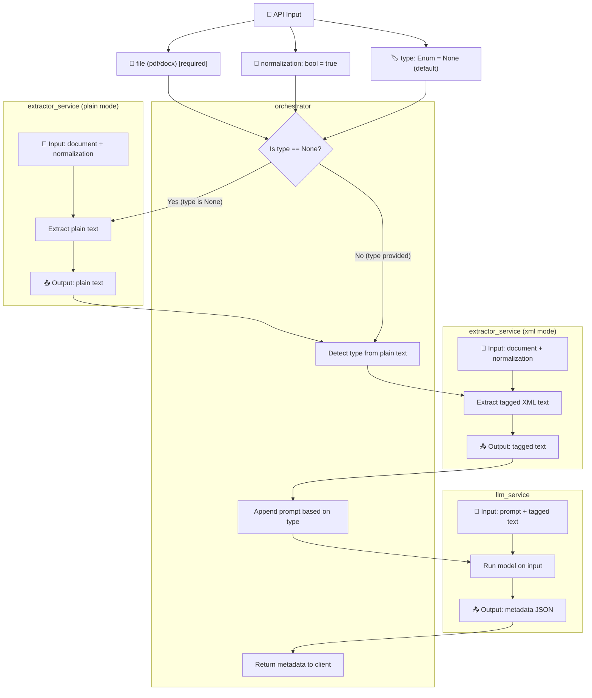

```mermaid
flowchart TD

%% --- Entrada del usuario ---
UserInput["🧾 API Input"]
File["📄 file (pdf/docx) [required]"]
Normalization["🧪 normalization: bool = true"]
Type["🏷️ type: Enum = None (default)"]
UserInput --> File
UserInput --> Normalization
UserInput --> Type
File --> B
Normalization --> B
Type --> B

%% --- Orquestador decide flujo ---
B{"Is type == None?"}

%% --- Rama: No se envía tipo ---
B -- "Yes (type is None)" --> C1
subgraph extractor_service_plain["extractor_service (plain mode)"]
    EX1_INPUT["📨 Input: document + normalization"]
    C1["Extract plain text"]
    EX1_OUTPUT["📤 Output: plain text"]
    EX1_INPUT --> C1 --> EX1_OUTPUT
end

EX1_OUTPUT --> C2["Detect type from plain text"]

%% --- Rama: Tipo enviado directamente ---
B -- "No (type provided)" --> C2

%% --- Extracción con etiquetas XML ---
C2 --> C3
subgraph extractor_service_xml["extractor_service (xml mode)"]
    EX2_INPUT["📨 Input: document + normalization"]
    C3["Extract tagged XML text"]
    EX2_OUTPUT["📤 Output: tagged text"]
    EX2_INPUT --> C3 --> EX2_OUTPUT
end

%% --- Lógica final: generación con LLM ---
EX2_OUTPUT --> E1["Append prompt based on type"]
E1 --> E2
subgraph llm_service
    LLM_INPUT["📨 Input: prompt + tagged text"]
    E2["Run model on input"]
    LLM_OUTPUT["📤 Output: metadata JSON"]
    LLM_INPUT --> E2 --> LLM_OUTPUT
end

LLM_OUTPUT --> F["Return metadata to client"]

%% --- Agrupación de orquestador ---
subgraph orchestrator
    B
    C2
    E1
    F
end
```