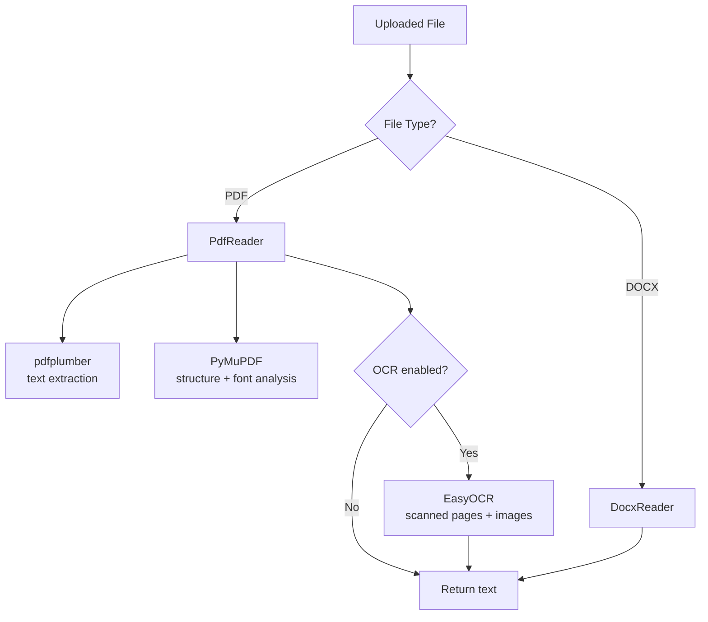

# Extractor Service

The Extractor Service handles text extraction from uploaded documents. It supports PDF and DOCX formats and uses a Strategy pattern for different readers.

## Running

```bash
# Standalone
cd api/app/extractor_service
./run_extractor_temp.sh   # uvicorn on port 8001
```

## Endpoints

### `POST /extract`

Extracts plain text from the document. Requires Bearer token (`EXTRACTOR_TOKEN`).

**Parameters:**

| Parameter | Type | Default | Description |
|-----------|------|---------|-------------|
| `file` | UploadFile | required | PDF or DOCX document |
| `normalization` | bool | `true` | Normalize extracted text |
| `ocr` | bool | `true` | Enable EasyOCR for scanned pages |

**Response:**

```json
{
  "success": true,
  "data": { "text": "extracted plain text without tags" },
  "error": null
}
```

### `POST /extract-with-tags`

Extracts text preserving document structure with XML tags (`<h1>`, `<h2>`, `<p>`, ``). Requires Bearer token (`EXTRACTOR_TOKEN`).

**Parameters:** Same as `/extract`.

**Response:**

```json
{
  "success": true,
  "data": { "text": "<h1>Title</h1><p>paragraph text...</p>OCR text from image</img>" },
  "error": null
}
```

### `GET /health`

No auth. Returns `{"message-info": "server is up"}`.

### `GET /test-integration`

Requires Bearer token. Returns `{"message": "Integration tests passed"}`.

**Error example (unsupported file):**

```json
{
  "success": false,
  "data": null,
  "error": { "code": 415, "message": "Unsupported file type. Allowed types are: .pdf, .docx" }
}
```

## Extraction Strategies



**PdfReader** features:

- Column layout detection (handles 2-column PDFs)
- Font size analysis to classify text into heading levels (`h1`, `h2`, `p`)
- Image extraction from PDF pages
- Duplicate image detection
- Text truncation at 4000 words

## Environment Variables

| Variable | Description |
|----------|-------------|
| `SERVICE_TOKEN` | Bearer token (set from `EXTRACTOR_TOKEN`) |

## Requirements

```
fastapi[standard]
python-docx==1.1.2
pdfplumber
uvicorn
numpy
Pillow
```

## Location

```
api/app/extractor_service/
├── Dockerfile
├── requirements.txt
├── run_extractor_temp.sh
└── app/
    ├── main.py
    ├── routers/router.py
    ├── constants/constant.py
    ├── middleware/security.py
    ├── errors/error.py
    └── service/
        ├── reader_strategy.py
        └── strategies/
            ├── pdf_reader_strategy.py
            └── word_reader_strategy.py
```
