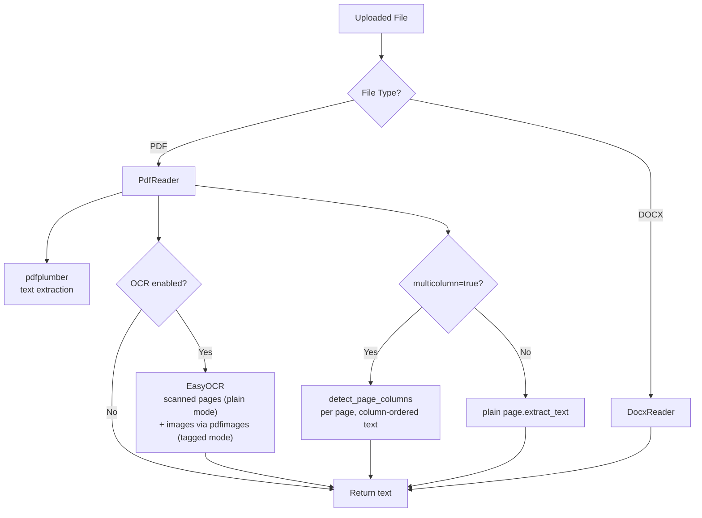

# Extractor Service

The Extractor Service handles text extraction from uploaded documents. It supports PDF and DOCX formats and uses a Strategy pattern for different readers.

## Running

```bash
# Standalone
cd api/app/extractor_service
./run_extractor_temp.sh   # uvicorn on port 8001
```

## Endpoints

### `POST /extract`

Extracts plain text from the document. Requires Bearer token (`EXTRACTOR_TOKEN`).

**Parameters:**

| Parameter | Type | Default | Description |
|-----------|------|---------|-------------|
| `file` | UploadFile | required | PDF or DOCX document |
| `normalization` | bool | `true` | Normalize extracted text |
| `ocr` | bool | `true` | Enable EasyOCR for scanned pages |
| `max_words` | int | `None` | Stop extraction after this many words (per-page boundary) |
| `multicolumn` | bool | `false` | Reorder text column-by-column for multi-column PDFs (left column first, then right) |
| `strip_footers` | bool | `false` | Remove text in the bottom 6% of each page |

**Response:**

```json
{
  "success": true,
  "data": { "text": "extracted plain text without tags", "is_multicolumn": false },
  "error": null
}
```

`is_multicolumn` is auto-detected from the first 5 content pages (see [Multi-Column Detection](#multi-column-detection)), regardless of whether `multicolumn` reordering was requested. For DOCX files it is always `false`.

### `POST /extract-with-tags`

Extracts text preserving document structure with XML tags (`<h1>`, `<h2>`, `<p>`, ``). Requires Bearer token (`EXTRACTOR_TOKEN`).

**Parameters:** `file`, `normalization`, `ocr`, `max_words` (no `multicolumn`/`strip_footers` support — tag extraction does not reorder columns).

**Response:**

```json
{
  "success": true,
  "data": { "text": "<h1>Title</h1><p>paragraph text...</p>OCR text from image</img>" },
  "error": null
}
```

### `GET /health`

No auth. Returns `{"message-info": "server is up"}`.

### `GET /test-integration`

Requires Bearer token. Returns `{"message": "Integration tests passed"}`.

**Error example (unsupported file):**

```json
{
  "success": false,
  "data": null,
  "error": { "code": 415, "message": "Unsupported file type. Allowed types are: .pdf, .docx" }
}
```

## Extraction Strategies


```mermaid
flowchart TD
    A[Uploaded File] --> B{File Type?}
    B -->|PDF| C[PdfReader]
    B -->|DOCX| D[DocxReader]
    C --> E[pdfplumber\ntext extraction]
    C --> CD{multicolumn=true?}
    CD -->|Yes| CC[detect_page_columns\nper page, column-ordered text]
    CD -->|No| CP[plain page.extract_text]
    C --> G{OCR enabled?}
    G -->|Yes| H["EasyOCR\nscanned pages (plain mode)\n+ images via pdfimages (tagged mode)"]
    G -->|No| I[Return text]
    H --> I
    CC --> I
    CP --> I
    D --> I
```

**PdfReader** features:

- Multi-column detection and column-ordered reordering (see below)
- Font size analysis to classify text into heading levels (`h1`, `h2`, `p`)
- Per-page OCR via EasyOCR: full-page OCR in plain mode (`/extract`), or `pdfimages`-extracted embedded images OCR'd individually in tagged mode (`/extract-with-tags`), with duplicate-image-size detection and page-sized-scan skipping
- Optional footer stripping (bottom 6% of each page)
- `max_words` truncation (per-page boundary)

## Multi-Column Detection

`app/service/utils/multicolumn.py` decides, per page, whether a page has 2 columns. Two independent methods vote:

- **Method A — char-gap**: groups characters by line (y-coordinate), looks for an x-gap in the 25–75% width zone of the line.
- **Method B — histogram**: bins word x-centers into 20 buckets, looks for a low-density valley in the middle zone; also detects a "right spike" (e.g. marginal notes) to avoid false positives.

A page is flagged multi-column if either method votes yes (with method A requiring confidence ≥ 0.35, and method B's right-spike heuristic suppressing method A on word-sparse pages). The document-level `is_multicolumn` flag is the majority vote (>60%) across the first 5 content pages with ≥25 words (or any page if the document has 1-2 pages).

When `multicolumn=true` is passed to `/extract`, multi-column pages are re-read **column-by-column** (`_extract_words_column_ordered`): words are bucketed onto lines, lines spanning the column split (full-width headings/captions) are kept inline, and the rest are assigned to a column by x-center before columns are emitted left-to-right.

## Environment Variables

| Variable | Description |
|----------|-------------|
| `SERVICE_TOKEN` | Bearer token (set from `EXTRACTOR_TOKEN`) |

## Requirements

```
fastapi[standard]
python-docx==1.1.2
pdfplumber
uvicorn
numpy
Pillow
easyocr
```

`poppler-utils` (for the `pdfimages` CLI used by per-image OCR) is installed in the Docker image, not via pip.

## Location

```
api/app/extractor_service/
├── Dockerfile
├── requirements.txt
├── run_extractor_temp.sh
└── app/
    ├── main.py
    ├── routers/router.py
    ├── constants/constant.py
    ├── middleware/security.py
    ├── errors/error.py
    └── service/
        ├── reader_strategy.py
        ├── strategies/
        │   ├── pdf_reader_strategy.py
        │   └── word_reader_strategy.py
        └── utils/
            ├── normalization_and_parse.py
            └── multicolumn.py        # Column-layout detection (methods A & B)
```
