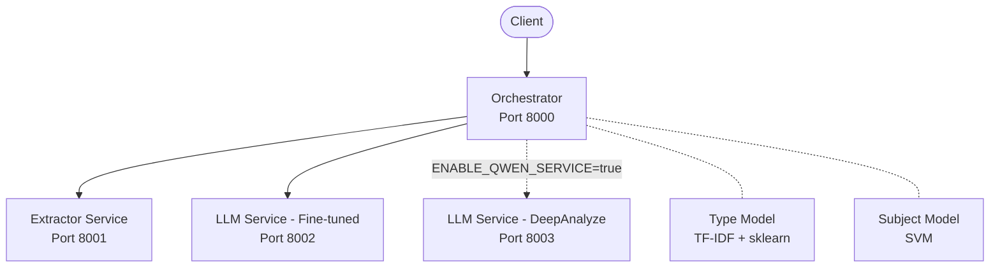

# API

The API is a microservices system where each service runs independently and communicates via HTTP. It can be run with Docker or locally without containers.

## Services Overview



| Service | Port | Role |
|---------|------|------|
| [Orchestrator](orchestrator.md) | 8000 | Main coordinator: receives uploads, calls other services, merges results |
| [Extractor](extractor.md) | 8001 | Text extraction from PDF/DOCX using pdfplumber + EasyOCR |
| [LLM Service](llm_service.md) | 8002 | Metadata extraction using fine-tuned LLM model |
| LLM Service - DeepAnalyze | 8003 | Optional 4th service: larger non-fine-tuned LLM that validates results before returning |

The LLM Service structure is reusable — DeepAnalyze is another instance of the same service with a different model. Set `ENABLE_QWEN_SERVICE=true` in `.env` to enable it.

## Running the API

### Option 1: Docker

```bash
cd api/app

# Without DeepAnalyze
docker compose up

# With DeepAnalyze (4th service)
ENABLE_QWEN_SERVICE=true docker compose --profile qwen up
```

### Option 2: Local (no containers)

```bash
cd api/app
./run_all_services.sh
```

This script:

1. Sources the `.env` file
2. Starts each service sequentially using `uvicorn --reload`
3. If `ENABLE_QWEN_SERVICE=true`, also starts the DeepAnalyze service on port 8003
4. Runs health checks on all services after startup

Each service folder also has its own run script (e.g. `run_orchestrator_temp.sh`, `run_extractor_temp.sh`, `run_llm_temp.sh`) that `run_all_services.sh` calls internally. You can use these to start a single service.

**Startup order**: Extractor (8001) → LLM LED (8002) → LLM QWEN (8003, optional) → Orchestrator (8000)

## Environment Variables

All variables are set in the root `.env` file. Below is the complete list:

### Authentication Tokens

| Variable | Used By |
|----------|---------|
| `ORCHESTRATOR_TOKEN` | Orchestrator bearer token |
| `EXTRACTOR_TOKEN` | Extractor Service bearer token |
| `LLM_LED_TOKEN` | LLM Service (fine-tuned) bearer token |
| `LLM_DEEPANALYZE_TOKEN` | LLM Service (DeepAnalyze) bearer token |

### Service URLs

| Variable | Default | Description |
|----------|---------|-------------|
| `EXTRACTOR_URL` | `http://localhost:8001` | Extractor Service URL (Docker uses container names) |
| `LLM_LED_URL` | `http://localhost:8002` | LLM Service URL |
| `LLM_DEEPANALYZE_URL` | `http://localhost:8003` | DeepAnalyze Service URL |

### Model Paths (Orchestrator)

| Variable | Default | Description |
|----------|---------|-------------|
| `IDENTIFIER_PATH_MODEL` | `models/modelo_tipo_documento.pkl` | Type classifier model |
| `IDENTIFIER_PATH_VECTORIZER` | `models/vectorizador_tfidf.pkl` | Type classifier vectorizer |
| `SUBJECT_IDENTIFIER_PATH_CLASSIFIER` | `models/svm_classifier.pkl` | Subject SVM model |
| `SUBJECT_IDENTIFIER_PATH_VECTORIZER` | `models/svm_vectorizer.pkl` | Subject vectorizer |
| `SUBJECT_IDENTIFIER_PATH_LABEL_ENCODER` | `models/svm_label_encoder.pkl` | Subject label encoder |

### LLM Service 1 (Fine-tuned, port 8002)

| Variable | Default | Description |
|----------|---------|-------------|
| `IS_LOCAL_MODEL1` | `true` | Use local HuggingFace model |
| `IS_OLLAMA_MODEL1` | `false` | Use Ollama-hosted model |
| `MODEL_SELECTED_SERVICE1` | `LED` | Model name |
| `MODEL_PATH_SERVICE1` | `fine-tuned-model` | Path to fine-tuned weights |
| `MAX_TOKENS_INPUT_SERVICE1` | `2048` | Max input tokens |
| `MAX_TOKENS_OUTPUT_SERVICE1` | `512` | Max output tokens |
| `TRUNACTION_SERVICE1` | `true` | Truncate input if too long |
| `SPECIAL_TOKENS_TREATMENT_SERVICE1` | `true` | Skip special tokens in output |
| `ERRORS_TREATMENT_SERVICE1` | `replace` | Encoding error handling |
| `QUANTIZATION_SERVICE1` | `false` | Enable 4-bit quantization |

### LLM Service 2 (DeepAnalyze, port 8003)

| Variable | Default | Description |
|----------|---------|-------------|
| `ENABLE_QWEN_SERVICE` | `false` | Enable the DeepAnalyze service |
| `IS_LOCAL_MODEL2` | `false` | Use local model |
| `IS_OLLAMA_MODEL2` | `true` | Use Ollama-hosted model |
| `MODEL_SELECTED_SERVICE2` | `QWEN` | Model name |
| `OLLAMA_HOST_URL` | `http://localhost:11434` | Ollama server URL |

## Docker Compose Structure

```
api/app/
├── docker-compose.yml
├── run_all_services.sh / .bat
├── .env
├── orchestrator/
│   └── run_orchestrator_temp.sh
├── extractor_service/
│   └── run_extractor_temp.sh
└── llm_service/
    └── run_llm_temp.sh
```

## Health Check Endpoints

All services expose a `GET /health` endpoint (no auth required):

```bash
curl http://localhost:8000/health  # Orchestrator
curl http://localhost:8001/health  # Extractor
curl http://localhost:8002/health  # LLM Service
curl http://localhost:8003/health  # DeepAnalyze (if enabled)
```

Integration test (requires Orchestrator token):

```bash
curl -H "Authorization: Bearer $ORCHESTRATOR_TOKEN" http://localhost:8000/test-integration
```
