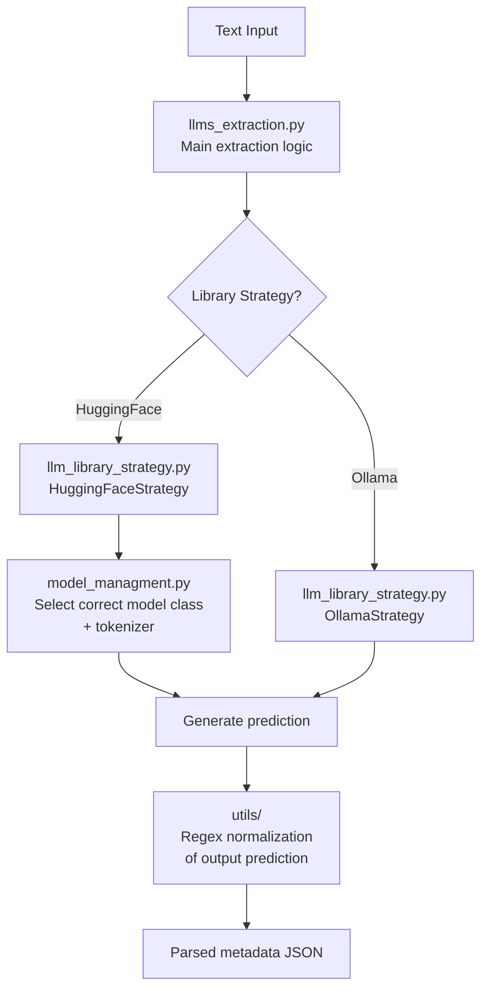

# LLM Service

The LLM Service runs language models to extract or validate structured metadata from document text. The same service structure is deployed as two instances:

- **Port 8002** — Fine-tuned model (e.g. LED) for metadata extraction
- **Port 8003** — DeepAnalyze (e.g. Qwen via Ollama) for result validation (optional, enabled with `ENABLE_QWEN_SERVICE=true`)

New LLM instances can be added by deploying another copy with different configuration.

## Running

```bash
# Standalone (fine-tuned model)
cd api/app/llm_service
./run_llm_temp.sh   # uvicorn on port 8002
```

## Endpoint

### `POST /consume-llm`

Receives text (with prompt prepended by Orchestrator) and returns extracted metadata. Requires Bearer token (`LLM_LED_TOKEN` or `LLM_DEEPANALYZE_TOKEN`).

**Parameters:**

| Parameter | Type | Description |
|-----------|------|-------------|
| `text` | string | Prompt + document text sent by the Orchestrator |

**Example request:**

```bash
curl -X POST http://localhost:8002/consume-llm \
  -H "Authorization: Bearer $LLM_LED_TOKEN" \
  -H "Content-Type: application/json" \
  -d '{"text": "Extract metadata from the following text: ..."}'
```

**Success response:**

```json
{
  "success": true,
  "data": {
    "title": "...",
    "creator": "...",
    "date": "..."
  },
  "error": null
}
```

**Error responses:**

```json
{"success": false, "data": null, "error": {"code": 400, "message": "No text input"}}
{"success": false, "data": null, "error": {"code": 500, "message": "cannot parse json output"}}
{"success": false, "data": null, "error": {"code": 500, "message": "server internal error"}}
```

### `GET /health`

No auth. Returns `{"message-info": "server is up"}`.

### `GET /test-integration`

Requires Bearer token. Returns `{"message": "Integration tests passed"}`.

## Internal Architecture

The `services/` folder is organized in four parts:



### `llms_extraction.py` — Main Extraction Logic

Entry point that receives text, delegates to the appropriate library strategy, and returns the final result.

### `llm_library_strategy.py` — Library Strategies

Two strategies for how to generate predictions:

| Strategy | Description |
|----------|-------------|
| `HuggingFaceStrategy` | Loads and runs fine-tuned models locally via Transformers |
| `OllamaStrategy` | Connects to an Ollama server for model inference |

### `model_managment.py` — Model Strategies (HuggingFace)

When using HuggingFace, this file selects the correct model class and tokenizer based on the model type:

| Model | Class | Tokenizer |
|-------|-------|-----------|
| LED, LED Large, LED Spanish | `LEDForConditionalGeneration` | `LEDTokenizer` |
| LLAMA, Qwen, GEMMA, DeepSeek-Qwen | `AutoModelForCausalLM` | `AutoTokenizer` |
| T5 | `T5ForConditionalGeneration` | `T5Tokenizer` |
| NuExtract | `AutoModelForCausalLM` | `AutoTokenizer` |

Also handles optional 4-bit quantization (BitsAndBytes) and CUDA device detection.

### `utils/` — Output Normalization

Regex-based cleanup of the raw model prediction output before parsing it as JSON (fixing malformed strings, normalizing fields, etc.).

## Supported Base Models

| Model | Architecture | Key |
|-------|-------------|-----|
| LED (default) | Seq2Seq | `allenai/led-base-16384` |
| LED Large | Seq2Seq | `allenai/led-large-16384` |
| LED Spanish | Seq2Seq | `vgaraujov/led-base-16384-spanish` |
| LLAMA | Causal | `meta-llama/Llama-3.2-1B` |
| GEMMA | Causal | `google/gemma-3-1b-pt` |
| Qwen | Causal | `Qwen/Qwen3-4B` |
| DeepSeek-Qwen | Causal | `deepseek-ai/DeepSeek-R1-Distill-Qwen-1.5B` |
| Mistral | Causal | `mistralai/Mistral-7B-v0.1` |
| NuExtract | Schema-based | `numind/NuExtract-tiny` |
| T5 | Seq2Seq | `google-t5/t5-base` |

## Fine-tuned Model Files

When using a local fine-tuned model, place the model files in `api/app/llm_service/app/models/fine-tuned-model-led/`:

```
fine-tuned-model-led/
├── config.json
├── generation_config.json
├── model.safetensors
├── tokenizer_config.json
├── special_tokens_map.json
├── vocab.json
└── merges.txt
```

The path is configured via `MODEL_PATH` environment variable.

## Environment Variables

### Service 1 — Fine-tuned (port 8002)

| Variable | Default | Description |
|----------|---------|-------------|
| `SERVICE_TOKEN` | — | Bearer token (from `LLM_LED_TOKEN`) |
| `IS_LOCAL_MODEL1` | `true` | Load model locally via HuggingFace |
| `IS_OLLAMA_MODEL1` | `false` | Use Ollama instead |
| `MODEL_SELECTED_SERVICE1` | `LED` | Model name |
| `MODEL_PATH_SERVICE1` | `fine-tuned-model` | Path to model weights |
| `MAX_TOKENS_INPUT_SERVICE1` | `2048` | Max input token length |
| `MAX_TOKENS_OUTPUT_SERVICE1` | `512` | Max new tokens to generate |
| `TRUNACTION_SERVICE1` | `true` | Truncate input if exceeds max |
| `SPECIAL_TOKENS_TREATMENT_SERVICE1` | `true` | Skip special tokens in output |
| `ERRORS_TREATMENT_SERVICE1` | `replace` | Encoding error handling |
| `QUANTIZATION_SERVICE1` | `false` | Enable 4-bit quantization (BitsAndBytes) |

### Service 2 — DeepAnalyze (port 8003)

| Variable | Default | Description |
|----------|---------|-------------|
| `ENABLE_QWEN_SERVICE` | `false` | Enable this service |
| `SERVICE_TOKEN` | — | Bearer token (from `LLM_DEEPANALYZE_TOKEN`) |
| `IS_LOCAL_MODEL2` | `false` | Load model locally |
| `IS_OLLAMA_MODEL2` | `true` | Use Ollama |
| `MODEL_SELECTED_SERVICE2` | `QWEN` | Model name |
| `OLLAMA_HOST_URL` | `http://localhost:11434` | Ollama server URL |

## Requirements

```
fastapi[standard]
transformers==4.41.2
uvicorn
torch
torchvision
torchaudio
ollama
```

## Location

```
api/app/llm_service/
├── Dockerfile
├── requirements.txt
├── run_llm_temp.sh
└── app/
    ├── main.py
    ├── routers/router.py
    ├── constants/constant.py
    ├── middleware/security.py
    ├── errors/error.py
    ├── models/
    │   └── fine-tuned-model-led/       # Fine-tuned model weights
    └── services/
        ├── llms_extraction.py           # Main extraction logic
        ├── llm_library_strategy.py      # Ollama & HuggingFace strategies
        ├── model_managment.py           # Model class + tokenizer selection
        └── utils/                       # Regex normalization of output
```
