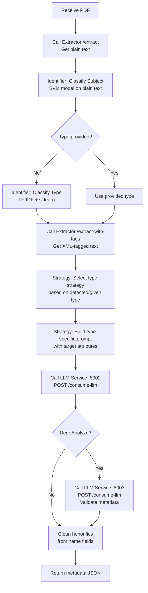

# Orchestrator Service

The Orchestrator is the main entry point. It receives document uploads, coordinates calls to the Extractor and LLM services, classifies document type and subject, and returns the final metadata JSON.

## Running

```bash
# Standalone
cd api/app/orchestrator
./run_orchestrator_temp.sh   # uvicorn on port 8000
```

Requires the Extractor and LLM services to be running.

## Endpoints

### `POST /upload`

Main endpoint. Requires Bearer token (`ORCHESTRATOR_TOKEN`).

**Parameters:**

| Parameter | Type | Default | Description |
|-----------|------|---------|-------------|
| `file` | UploadFile | required | PDF or DOCX document |
| `normalization` | bool | `true` | Normalize extracted text (remove duplicated chars, fix numbers) |
| `ocr` | bool | `false` | Enable EasyOCR for scanned pages |
| `deepanalyze` | bool | `false` | Validate results with a larger LLM before returning |
| `type` | string | `None` | Specify type manually, skipping ML type detection. Values: `Articulo`, `Libro`, `Tesis`, `Objeto de conferencia`, `General` |

**Example request:**

```bash
curl -X POST http://localhost:8000/upload \
  -H "Authorization: Bearer $ORCHESTRATOR_TOKEN" \
  -F "file=@document.pdf" \
  -F "normalization=true" \
  -F "ocr=false" \
  -F "deepanalyze=false"
```

**Success response:**

```json
{
  "success": true,
  "data": {
    "type": "Tesis",
    "subject": "Ciencias de la Computacion",
    "title": "...",
    "creator": "...",
    "date": "...",
    "rights": "...",
    "director": "...",
    "codirector": "..."
  },
  "error": null
}
```

**Error response:**

```json
{
  "success": false,
  "data": null,
  "error": { "code": 400, "message": "No file part" }
}
```

### `GET /health`

No auth. Returns `{"message-info": "server is up"}`.

### `GET /test-integration`

Requires Bearer token. Tests connectivity to all dependent services.

## Processing Flow



## Internal Architecture

The orchestrator's `service/` folder is organized in three parts:

### `service/orchestrator.py` — Orchestration Logic

Main coordinator that handles the full workflow: calling Extractor, running identifiers, selecting strategy, calling LLM, and assembling the final response.

### `service/identifier/` — ML Prediction

Runs the ML models to predict:

- **Document type**: TF-IDF vectorizer + sklearn classifier → Tesis, Libro, Articulo, Objeto de conferencia
- **Subject**: SVM classifier → FORD subject category (e.g. Ciencias de la Computacion)

### `service/strategy/` — Type-Specific Strategies

Based on the detected (or provided) document type, a strategy is selected. Each strategy builds a **different prompt** for the LLM, specifying which attributes to extract for that type:

| Strategy | Type | Attributes Extracted |
|----------|------|----------------------|
| Tesis | Thesis | General + `director`, `codirector`, `degree.grantor`, `degree.name` |
| Libro | Book | General + `publisher`, `isbn`, `compiler` |
| Articulo | Article | General + `journalTitle`, `journalVolumeAndIssue`, `issn`, `event` |
| Objeto de conferencia | Conference Object | General + `issn`, `event` |
| General | Fallback | `creator`, `title`, `rights`, `rightsurl`, `date`, `originPlaceInfo` |

This is why type detection matters — the LLM only extracts the fields relevant to the document type.

## Models Required

All models must be placed in `api/app/orchestrator/app/models/`:

| File | Size | Description |
|------|------|-------------|
| `modelo_tipo_documento.pkl` | ~121 KB | Document type classifier (sklearn) |
| `vectorizador_tfidf.pkl` | ~198 KB | TF-IDF vectorizer for type classification |
| `svm_classifier.pkl` | ~66 MB | Subject SVM classifier |
| `svm_vectorizer.pkl` | ~2.7 MB | TF-IDF vectorizer for subject classification |
| `svm_label_encoder.pkl` | ~8 KB | Label encoder for subject predictions |

## Requirements

```
fastapi[standard]
uvicorn
scikit-learn>=1.2.0
joblib>=1.2.0
requests
python-dotenv
```

## Location

```
api/app/orchestrator/
├── Dockerfile
├── requirements.txt
├── run_orchestrator_temp.sh
└── app/
    ├── main.py
    ├── routers/router.py
    ├── constants/constant.py
    ├── middleware/security.py
    ├── errors/errors.py
    ├── models/
    │   ├── modelo_tipo_documento.pkl
    │   ├── vectorizador_tfidf.pkl
    │   ├── svm_classifier.pkl
    │   ├── svm_vectorizer.pkl
    │   └── svm_label_encoder.pkl
    └── service/
        ├── orchestrator.py          # Main coordination logic
        ├── identifier/              # ML type & subject prediction
        └── strategy/
            └── type_strategy.py     # Type-specific prompt builders
```
