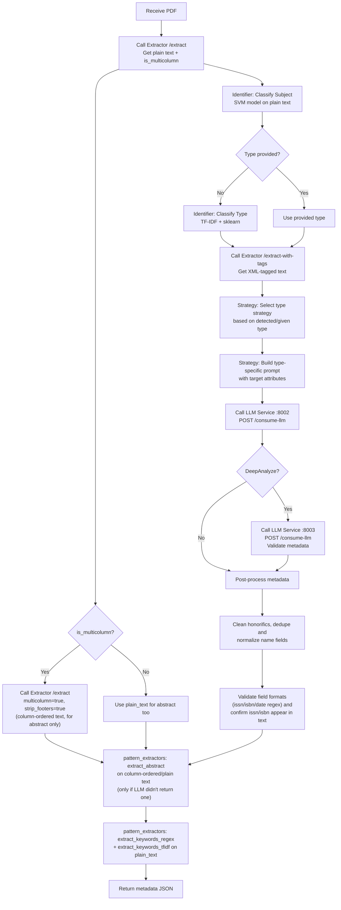

# Orchestrator Service

The Orchestrator is the main entry point. It receives document uploads, coordinates calls to the Extractor and LLM services, classifies document type and subject, and returns the final metadata JSON.

## Running

```bash
# Standalone
cd api/app/orchestrator
./run_orchestrator_temp.sh   # uvicorn on port 8000
```

Requires the Extractor and LLM services to be running.

## Endpoints

### `POST /upload`

Main endpoint. Requires Bearer token (`ORCHESTRATOR_TOKEN`).

**Parameters:**

| Parameter | Type | Default | Description |
|-----------|------|---------|-------------|
| `file` | UploadFile | required | PDF or DOCX document |
| `normalization` | bool | `true` | Normalize extracted text (remove duplicated chars, fix numbers) |
| `ocr` | bool | `false` | Enable EasyOCR for scanned pages |
| `deepanalyze` | bool | `false` | Validate results with a larger LLM before returning |
| `type` | string | `None` | Specify type manually, skipping ML type detection. Values: `Articulo`, `Libro`, `Tesis`, `Objeto de conferencia`, `General` |

The orchestrator does not expose `multicolumn`/`strip_footers` itself — it detects multi-column documents automatically (via the Extractor's `is_multicolumn` flag) and re-requests column-ordered text internally only for abstract extraction. See [Processing Flow](#processing-flow).

**Example request:**

```bash
curl -X POST http://localhost:8000/upload \
  -H "Authorization: Bearer $ORCHESTRATOR_TOKEN" \
  -F "file=@document.pdf" \
  -F "normalization=true" \
  -F "ocr=false" \
  -F "deepanalyze=false"
```

**Success response:**

```json
{
  "success": true,
  "data": {
    "type": "Tesis",
    "subject": "Ciencias de la Computacion",
    "title": "...",
    "creator": "...",
    "date": "...",
    "rights": "...",
    "director": "...",
    "codirector": "...",
    "abstract": "...",
    "keywords": {"real": ["keyword one", "keyword two"], "suggested": ["tfidf term one", "tfidf term two"]}
  },
  "error": null
}
```

`abstract` and `keywords` are never extracted by the LLM — they are always produced by `pattern_extractors.py` after the LLM call (see [Processing Flow](#processing-flow)). `keywords.real` comes from an explicit "Keywords:" section in the text (empty list if none found); `keywords.suggested` comes from TF-IDF ranking against a pre-built vocabulary, regardless of whether a real section was found.

**Error response:**

```json
{
  "success": false,
  "data": null,
  "error": { "code": 400, "message": "No file part" }
}
```

### `GET /health`

No auth. Returns `{"message-info": "server is up"}`.

### `GET /test-integration`

Requires Bearer token. Tests connectivity to all dependent services.

## Processing Flow


```mermaid
flowchart TD
    A[Receive PDF] --> B["Call Extractor /extract\nGet plain text + is_multicolumn"]
    B --> C["Identifier: Classify Subject\nSVM model on plain text"]
    C --> D{Type provided?}
    D -->|No| E["Identifier: Classify Type\nTF-IDF + sklearn"]
    D -->|Yes| F[Use provided type]
    E --> G[Call Extractor /extract-with-tags\nGet XML-tagged text]
    F --> G
    B --> MC{is_multicolumn?}
    MC -->|Yes| MCX["Call Extractor /extract\nmulticolumn=true, strip_footers=true\n(column-ordered text, for abstract only)"]
    MC -->|No| MCN[Use plain_text for abstract too]
    G --> H["Strategy: Select type strategy\nbased on detected/given type"]
    H --> I["Strategy: Build type-specific prompt\nwith target attributes"]
    I --> J[Call LLM Service :8002\nPOST /consume-llm]
    J --> K{DeepAnalyze?}
    K -->|Yes| L[Call LLM Service :8003\nPOST /consume-llm\nValidate metadata]
    K -->|No| P[Post-process metadata]
    L --> P
    P --> P1[Clean honorifics, dedupe and\nnormalize name fields]
    P1 --> P2["Validate field formats\n(issn/isbn/date regex) and\nconfirm issn/isbn appear in text"]
    MCX --> P3
    MCN --> P3
    P2 --> P3["pattern_extractors: extract_abstract\non column-ordered/plain text\n(only if LLM didn't return one)"]
    P3 --> P4["pattern_extractors: extract_keywords_regex\n+ extract_keywords_tfidf on plain_text"]
    P4 --> N[Return metadata JSON]
```

## Internal Architecture

The orchestrator's `service/` folder is organized in four parts:

### `service/orchestrator.py` — Orchestration Logic

Main coordinator that handles the full workflow: calling Extractor (plain + tagged + multicolumn variants), running identifiers, selecting strategy, calling LLM, and post-processing the final response (honorifics, deduplication, name normalization, field-format validation, abstract/keyword pattern extraction).

### `service/indentifier.py` — ML Prediction

Runs the ML models to predict:

- **Document type**: TF-IDF vectorizer + sklearn classifier → Tesis, Libro, Articulo, Objeto de conferencia
- **Subject**: SVM classifier → FORD subject category (e.g. Ciencias de la Computacion)

### `service/strategies/type_strategy.py` — Type-Specific Strategies

Based on the detected (or provided) document type, a strategy is selected. Each strategy builds a **different prompt** for the LLM, specifying which attributes to extract for that type:

| Strategy | Type | Attributes Extracted by LLM |
|----------|------|----------------------|
| Tesis | Thesis | General + `director`, `codirector`, `degree.grantor`, `degree.name` |
| Libro | Book | General + `publisher`, `isbn`, `compiler` |
| Articulo | Article | General + `journalTitle`, `journalVolumeAndIssue`, `issn`, `event` |
| Objeto de conferencia | Conference Object | General + `issn`, `event` |
| General | Fallback | `creator`, `title`, `rights`, `rightsurl`, `date`, `originPlaceInfo`, `isRelatedWith` |

This is why type detection matters — the LLM only extracts the fields relevant to the document type. `abstract` and `keywords` are **not** in any strategy's key list — they are always added afterward by `pattern_extractors.py`, not by the LLM.

### `service/pattern_extractors.py` — Regex/TF-IDF Abstract & Keywords

Pure pattern-based extraction run after the LLM call, independent of document type:

| Function | Approach |
|----------|----------|
| `extract_abstract(text)` | Regex heading detection — finds a "Resumen"/"Abstract"/"Summary"/etc. heading (Spanish headings prioritized), collects following lines until a stop-heading (Introduction, Keywords, References, ...), page marker, or 8000-char cap. Only used if the LLM didn't already return an abstract. |
| `extract_keywords_regex(text)` | Finds an explicit "Keywords:"/"Palabras clave:" line and splits it into terms. Returns `[]` if no such section exists — this becomes `keywords.real`. |
| `extract_keywords_tfidf(text, vectorizer)` | Ranks terms (with bigram boosting and stemming-based dedup) against a pre-built `TfidfVectorizer` loaded from `TFIDF_VECTORIZER_PATH` (default `app/models/tfidf_vectorizer.pkl`). Returns up to 10 terms — this becomes `keywords.suggested`. Requires `sklearn` + `nltk` (with Spanish/English stopwords); silently returns `[]` if unavailable. |
| `load_vectorizer(path)` | Loads the pickled vectorizer once at `Orchestrator.__init__`; logs a warning and disables TF-IDF keywords if the file is missing. |

Abstract extraction runs on **column-ordered text** when the document was detected as multi-column (`is_multicolumn=True` from the Extractor) — the orchestrator re-calls `/extract` with `multicolumn=true, strip_footers=true` specifically to get a clean linear read order for the abstract. Keyword extraction always uses the original `plain_text` (footer/header noise doesn't hurt TF-IDF/regex matching as much as it hurts abstract continuity).

## Models Required

All models must be placed in `api/app/orchestrator/app/models/`. Run `api/app/init.sh` to download them automatically from the public `Nahpanigo99/sedici-ml-models` Hugging Face dataset.

| File | Size | Description |
|------|------|-------------|
| `type_svm_classifier.pkl` | ~121 KB | Document type classifier (sklearn) |
| `type_svm_vectorizer.pkl` | ~198 KB | TF-IDF vectorizer for type classification |
| `type_svm_label_encoder.pkl` | ~8 KB | Label encoder for type predictions |
| `subject_svm_classifier.pkl` | ~66 MB | Subject SVM classifier |
| `subject_svm_vectorizer.pkl` | ~2.7 MB | TF-IDF vectorizer for subject classification |
| `subject_svm_label_encoder.pkl` | ~8 KB | Label encoder for subject predictions |
| `tfidf_vectorizer.pkl` | ~198 KB | TF-IDF vectorizer for kewywords extraction |

## Environment Variables

| Variable | Default | Description |
|----------|---------|-------------|
| `EXTRACTOR_URL` / `EXTRACTOR_TOKEN` | — | Extractor service URL + bearer token |
| `LLM_LED_URL` / `LLM_LED_TOKEN` | — | LLM Service (fine-tuned, :8002) URL + bearer token |
| `LLM_DEEPANALYZE_URL` / `LLM_DEEPANALYZE_TOKEN` | — | LLM Service (DeepAnalyze, :8003) URL + bearer token |
| `ENABLE_QWEN_SERVICE` | `false` | Whether `/test-integration` also checks the DeepAnalyze service |
| `IDENTIFIER_PATH_MODEL` / `IDENTIFIER_PATH_VECTORIZER` / `IDENTIFIER_PATH_LABEL_ENCODER` | `models/type_svm_classifier.pkl` / `models/type_svm_vectorizer.pkl` / `models/type_svm_label_encoder.pkl` | Document type classifier model/vectorizer/label-encoder paths |
| `SUBJECT_IDENTIFIER_PATH_CLASSIFIER` | `models/subject_svm_classifier.pkl` | Subject SVM classifier path |
| `SUBJECT_IDENTIFIER_PATH_VECTORIZER` | `models/subject_svm_vectorizer.pkl` | Subject TF-IDF vectorizer path |
| `SUBJECT_IDENTIFIER_PATH_LABEL_ENCODER` | `models/subject_svm_label_encoder.pkl` | Subject label encoder path |
| `TFIDF_VECTORIZER_PATH` | `app/models/tfidf_vectorizer.pkl` | TF-IDF vectorizer for `extract_keywords_tfidf` — keyword suggestions silently disabled if missing |

## Requirements

```
fastapi[standard]
uvicorn
scikit-learn>=1.2.0
joblib>=1.2.0
requests
python-dotenv
nltk
```

## Location

```
api/app/orchestrator/
├── Dockerfile
├── requirements.txt
├── run_orchestrator_temp.sh
└── app/
    ├── main.py
    ├── routers/router.py
    ├── constants/constant.py
    ├── middleware/security.py
    ├── errors/errors.py
    ├── models/
    │   ├── modelo_tipo_documento.pkl
    │   ├── vectorizador_tfidf.pkl
    │   ├── tfidf_vectorizer.pkl
    │   ├── svm_classifier.pkl
    │   ├── svm_vectorizer.pkl
    │   └── svm_label_encoder.pkl
    └── service/
        ├── orchestrator.py          # Main coordination logic
        ├── pattern_extractors.py    # Regex/TF-IDF abstract and keywords extraction
        ├── indentifier.py           # ML type & subject prediction
        └── strategies/
            └── type_strategy.py     # Type-specific prompt builders
```
