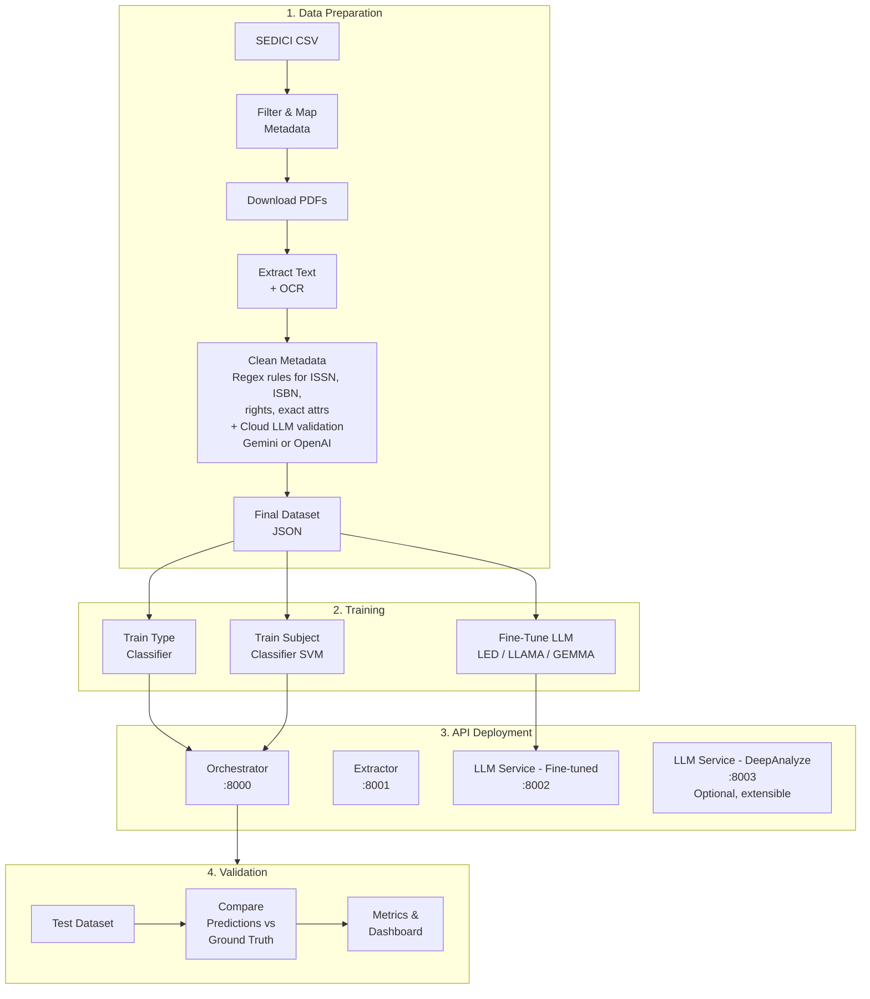
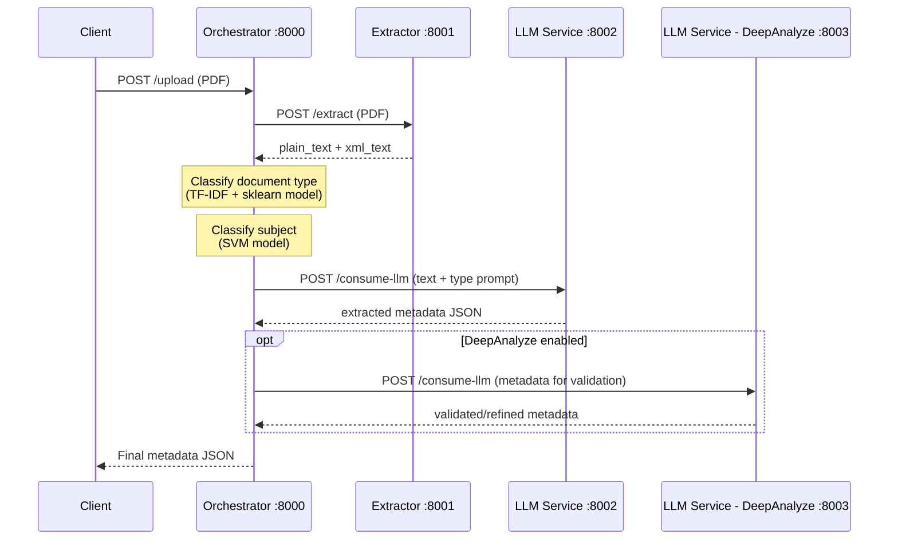
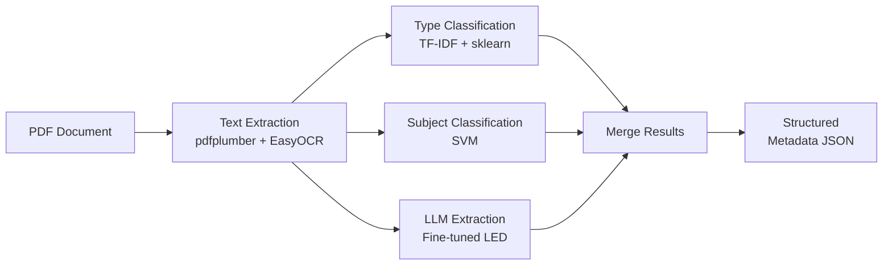

# Architecture

## End-to-End Pipeline

The project follows a sequential pipeline from raw data to deployed API:

## API Microservices Architecture

When a user uploads a PDF, the Orchestrator coordinates the services:

!!! info "Extensible LLM Services"
    The LLM Service structure is reusable. DeepAnalyze runs as a separate instance of the same service on port 8003, using a larger non-fine-tuned model to validate results. New LLM services can be added following the same pattern.

## Data Flow Through the System

## Technology Stack

| Layer | Technology |
|-------|-----------|
| API Framework | FastAPI + Uvicorn |
| Containerization | Docker + Docker Compose |
| Text Extraction | pdfplumber, PyMuPDF, EasyOCR |
| LLM Fine-Tuning | HuggingFace Transformers, PEFT, LoRA |
| Base Models | LED (primary), LLAMA, GEMMA, Mistral |
| Classification | scikit-learn, XGBoost |
| Data Cleaning | Google Gemini API / OpenAI API + regex rules |
| Frontend (Metrics) | React + TypeScript + Recharts |
