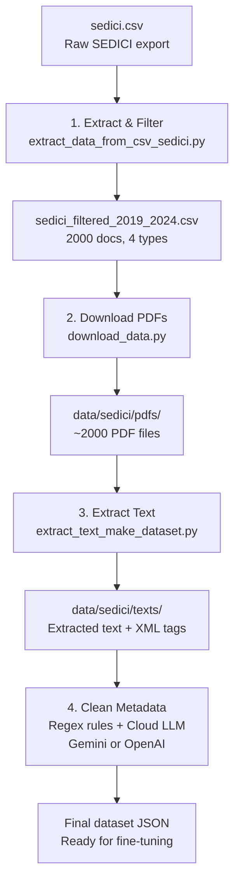

# Data Pipeline

This module handles the full data preparation pipeline: from the raw SEDICI CSV export to a clean, structured dataset ready for fine-tuning.

Run with:

```bash
./run_modules.sh make_dataset
```

## Pipeline Stages



## Stage Details

### 1. Extract & Filter CSV

**File**: `extract_data_from_csv_sedici.py`

- Reads `data/sedici/csv/sedici.csv`
- Filters documents by 4 types: Libro, Tesis, Articulo, Objeto de conferencia
- Samples 500 documents per type (2000 total)
- Maps columns using `COLUMNS_TYPES` from `constants.py`
- Transforms metadata (URIs, subjects, contributors)
- Uses FORD (Frascati classification) for subject mapping

### 2. Download PDFs

**File**: `download_data.py`

- Downloads PDFs from SEDICI repository
- URL pattern: `https://sedici.unlp.edu.ar/bitstream/handle/{id}/Documento_completo.pdf`
- Handles HTTP 429 (rate limiting) with exponential backoff
- Stores files in `data/sedici/pdfs/`

### 3. Extract Text

**File**: `extract_text_make_dataset.py`

- Uses parallel processing (multiprocessing Pool)
- Extracts text from PDFs with XML structural tags
- Applies EasyOCR for scanned documents
- Outputs raw text files to `data/sedici/texts/`
- Creates `metadata_sedici_and_text.json`

### 4. Clean Metadata

**Folder**: `cloud_llm_cleaner_consumer/`

Two-step cleaning:

1. **Regex rules**: Normalize ISSN, ISBN, rights, and other exact attributes using pattern matching
2. **Cloud LLM**: Validate and correct metadata against extracted text, remove honorifics, normalize dates, events, and journalVolumeAndIssue

The cloud LLM provider is configurable via `CLEAN_PROVIDER_TO_USE` in `constants.py`. Supported providers:

| Provider | Class | Model |
|----------|-------|-------|
| `"genai"` (default) | `GenaiConsumer` | `gemini-2.5-flash-lite` |
| `"openai"` | `OpenaiConsumer` | `gpt-4o-mini` |

Both providers share the same base class (`BaseCloudLLMConsumer`) which handles rate limiting, request queuing, JSON saving, and metadata processing. Each provider only implements the actual API call.

```
cloud_llm_cleaner_consumer/
├── __init__.py
├── base_consumer.py       # Abstract base: rate limits, processing loop
├── genai_consumer.py      # Gemini API call
└── openai_consumer.py     # OpenAI API call
```

Rate limits are configured per provider in `constants.py` (e.g. `GENAI_REQUEST_LIMIT`, `OPENAI_REQUEST_LIMIT`).

Output: `metadata_sedici_and_text_cleaned_with_ocr.json`

## Requirements

- `GOOGLE_API_KEY` in `.env` (when using Gemini)
- `OPENAI_API_KEY` in `.env` (when using OpenAI)
- `data/sedici/csv/sedici.csv` as input

## Output Dataset Structure

```json
{
  "training": [
    {
      "id": "10915-123456",
      "dc.type": "Tesis",
      "title": "...",
      "creator": "...",
      "original_text": "..."
    }
  ],
  "validation": [...],
  "test": [...]
}
```

Split: 80% training / 10% validation / 10% test.
