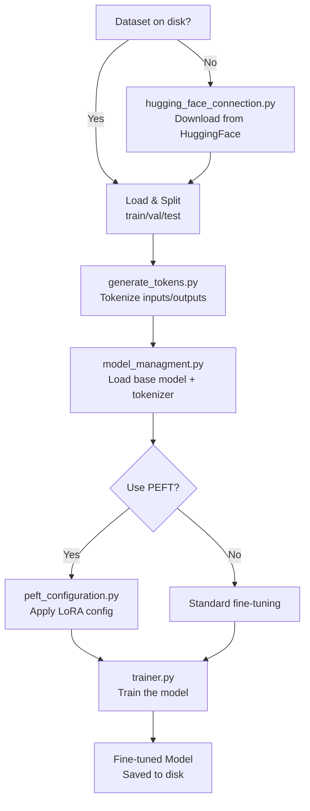

# Fine-Tuning (LLM)

This module fine-tunes a base language model to extract structured metadata from academic document text. The primary model is **LED** (Longformer Encoder-Decoder), but other models are also supported.

Run with:

```bash
./run_modules.sh fine_tunning
```

## Process Flow



## Module Structure

| File | Responsibility |
|------|---------------|
| `main.py` | Orchestrates the full training pipeline |
| `hugging_face_connection.py` | Downloads the dataset from HuggingFace if it doesn't exist on disk |
| `generate_tokens.py` | Converts text + metadata into tokenized inputs/outputs |
| `model_managment.py` | Loads base models, handles quantization |
| `peft_configuration.py` | PEFT/LoRA configuration when using parameter-efficient fine-tuning |
| `trainer.py` | Training: HuggingFace Trainer configuration and also a traditional training loop |

## Tokenization Strategies

Two approaches for converting documents to model input:

- **Prompt-based**: Uses type-specific prompts from `constants.py` (e.g., `PROMPT_TESIS`, `PROMPT_LIBRO`)
- **Schema-based**: Uses JSON schema (for NuExtract model)

Token limits:

- Max input: **2048 tokens**
- Max output: **512 tokens**

## Supported Models

| Model | Architecture | Optimizations |
|-------|-------------|--------------|
| LED (default) | Seq2Seq | Long context (16k tokens) |
| LED Large | Seq2Seq | Larger capacity |
| LED Spanish | Seq2Seq | Pre-trained on Spanish |
| LLAMA | Causal | LoRA + 4-bit quantization |
| GEMMA | Causal | LoRA + 4-bit quantization |
| Mistral | Causal | LoRA + 4-bit quantization |
| T5 | Seq2Seq | Standard fine-tuning |
| NuExtract | Schema-based | Schema-guided extraction |

## Training Modes

### HuggingFace Trainer
Uses the HuggingFace `Trainer` API with configurable training arguments (learning rate, epochs, batch size, etc.).

### Traditional Training Loop
Custom training loop with manual optimization steps, gradient clipping, and evaluation — useful for more control over the training process.

## Optimizations

- **PEFT/LoRA**: Parameter-Efficient Fine-Tuning to reduce memory usage (configured in `peft_configuration.py`)
- **4-bit Quantization**: BitsAndBytes quantization for large models
- **Gradient Clipping**: Prevents exploding gradients during training
- **CUDA**: Automatic GPU detection and usage

## Output

The fine-tuned model is saved to `fine-tuned-model-With-Objeto-Conferencia/` and is loaded by the API's LLM Service at runtime.

## Requirements

- Dataset JSON in `data/sedici/jsons/` (or downloads from HuggingFace automatically)
- `TOKEN_HUGGING_FACE` in `.env`
- GPU recommended for training
