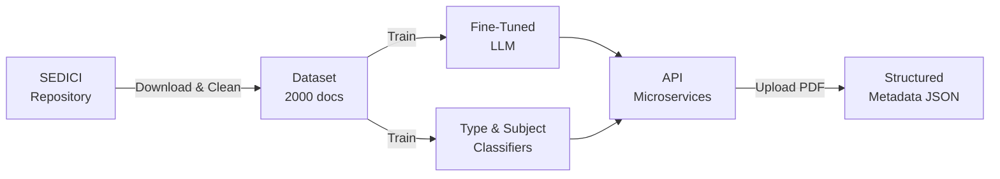

# Document Metadata Extraction with LLM

Automatic extraction of bibliographic metadata from academic documents (theses, articles, books, conference objects) using fine-tuned language models. Built around the **SEDICI** repository (Servicio de Difusion de la Creacion Intelectual) at Universidad Nacional de La Plata.

## Project Goal

Given an academic PDF document, automatically extract structured metadata such as title, authors, date, language, rights, and type-specific fields (director, ISBN, ISSN, etc.) using fine-tuned LLMs and ML classifiers.

## High-Level Flow

## Project Structure

| Folder / File | Description |
|---------------|-------------|
| `api/` | FastAPI microservices (Orchestrator, Extractor, LLM Service) |
| `download_prepare_clean_normalize_sedici_dataset/` | Data preparation pipeline: download, extract text, clean metadata |
| `fine_tunning/` | LLM fine-tuning module (LED, LLAMA, GEMMA, etc.) |
| `fine_tune_type/` | Document type classifier (Libro, Tesis, Articulo, Objeto de conferencia) |
| `fine_tune_subject/` | Subject/topic classifier using multiple ML models (SVM, XGBoost, etc.) |
| `validation/` | Model evaluation and comparison against ground truth |
| `utils/` | Shared utilities (text extraction, normalization, API clients) |
| `data/` | Data storage (CSVs, PDFs, extracted texts, JSONs) |
| `constants.py` | Global configuration, prompts, model definitions, field mappings |
| `run_modules.sh` / `run_modules.bat` | Entry-point scripts to run each module |

## Supported Document Types

| Type | Spanish | Example Specific Fields |
|------|---------|------------------------|
| Thesis | Tesis | director, codirector, degree |
| Book | Libro | publisher, ISBN |
| Article | Articulo | ISSN, journal |
| Conference Object | Objeto de conferencia | ISSN, event |

## Technologies

- **Deep Learning**: PyTorch, Transformers (Hugging Face), PEFT, LoRA
- **Base Models**: LED, LLAMA, GEMMA, Mistral, T5, NuExtract
- **Document Processing**: pdfplumber, PyMuPDF, EasyOCR
- **ML Classifiers**: scikit-learn (SVM), XGBoost, Random Forest
- **API**: FastAPI, Docker, Docker Compose
- **Data Cleaning**: Google Gemini API, OpenAI API (configurable)
