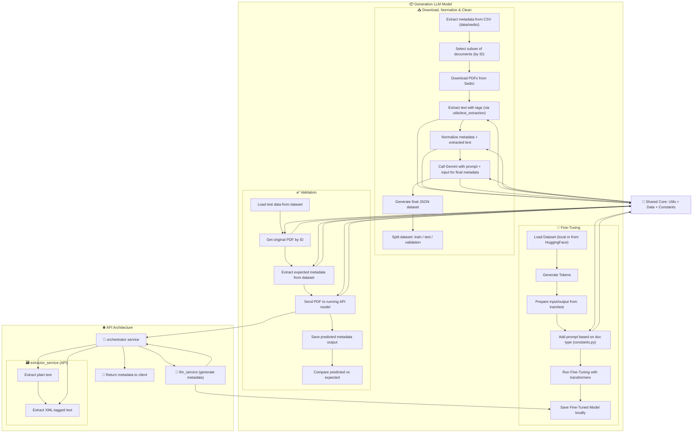

```mermaid
flowchart TD

%% --- Caja principal: generación del modelo ---
subgraph LLMGenerationModel["📦 Generation LLM Model"]
    direction TB

    %% --- Sección 1: Download & Normalize ---
    subgraph DownloadSection["📥 Download, Normalize & Clean"]
        DN1["Extract metadata from CSV (data/sedici)"]
        DN2["Select subset of documents (by ID)"]
        DN3["Download PDFs from Sedici"]
        DN4["Extract text with tags (via utils/text_extraction)"]
        DN5["Normalize metadata + extracted text"]
        DN6["Call Gemini with prompt + input for final metadata"]
        DN7["Generate final JSON dataset"]
        DN8["Split dataset: train / test / validation"]
        DN1 --> DN2 --> DN3 --> DN4 --> DN5 --> DN6 --> DN7 --> DN8
    end

    %% --- Sección 2: Fine-Tuning ---
    subgraph FineTuneSection["🧠 Fine-Tuning"]
        FT1["Load Dataset (local or from HuggingFace)"]
        FT2["Generate Tokens"]
        FT2a["Prepare input/output from train/test"]
        FT2b["Add prompt based on doc type (constants.py)"]
        FT3["Run Fine-Tuning with transformers"]
        FT4["Save Fine-Tuned Model locally"]
        FT1 --> FT2 --> FT2a --> FT2b --> FT3 --> FT4
    end

    %% --- Sección 3: Validación detallada ---
    subgraph ValidationSection["✅ Validation"]
        V1["Load test data from dataset"]
        V2["Get original PDF by ID"]
        V3["Extract expected metadata from dataset"]
        V4["Send PDF to running API model"]
        V5["Save predicted metadata output"]
        V6["Compare predicted vs expected"]
        V1 --> V2 --> V3 --> V4 --> V5 --> V6
    end
end

%% --- Núcleo compartido ---
Shared["🧩 Shared Core: Utils + Data + Constants"]

%% --- API detallada como subgraph ---
subgraph API["🌐 API Architecture"]
    direction TB

    ORQ["🧭 orchestrator service"]

    subgraph EXT["🗃 extractor_service (API)"]
        EXT1["Extract plain text"]
        EXT2["Extract XML-tagged text"]
        EXT1 --> EXT2
    end

    LLM["🧠 llm_service (generate metadata)"]

    %% Flujo interno API
    ORQ --> EXT1
    ORQ --> EXT2
    ORQ --> LLM
    LLM --> ORQ
    ORQ --> RESP["📝 Return metadata to client"]
end

%% --- Conexiones al core compartido ---
DN4 --> Shared
DN5 --> Shared
DN6 --> Shared
FT2b --> Shared
V2 --> Shared
V3 --> Shared
V4 --> Shared

Shared --> DN4
Shared --> DN5
Shared --> DN6
Shared --> FT2b
Shared --> V2
Shared --> V3
Shared --> V4

%% --- Conexiones con la API ---
V4 --> ORQ
LLM --> FT4
```